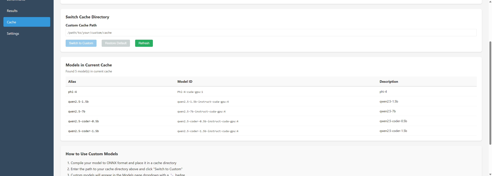
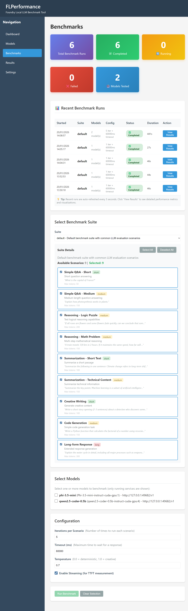
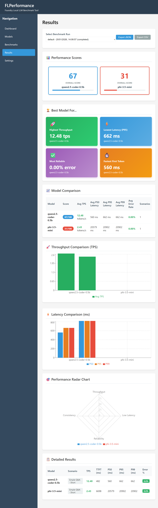

# Benchmarking Local LLMs: How We Built FLPerformance for Microsoft Foundry Local

**TL;DR**: FLPerformance an open-source benchmarking tool that makes it really simple to compare LLM performance on your local hardware using Microsoft Foundry Local. Get real metrics (TPS, latency, TTFT) with beautiful visualizations, no cloud API costs required.

---

## The Problem: "Which Model Should I Actually Use?"

As developers integrating LLMs into applications, we've all been there: You download a few models, run some basic prompts, and... now what? Which model is actually faster on *your* hardware? How does a 0.5B model compare to a 3B model for your specific use case? Is the extra RAM worth it?

Without proper benchmarking, you're flying blind. You might choose a model that's 3x slower than necessary, or waste hours tuning prompts only to discover the model can't handle your load.

**We needed answers. So I built FLPerformance.**

## What is FLPerformance?

FLPerformance is a full-stack web application that benchmarks Large Language Models running via [Microsoft Foundry Local](https://aka.ms/foundry-local-docs). Think of it as your local LLM testing lab with a clean UI, comprehensive metrics, and zero cloud costs.

### Key Features

- **🎯 Comprehensive Metrics**: TPS, TTFT, latency percentiles (P50/P95/P99), error rates, and resource utilization
- **📊 Beautiful Visualizations**: Performance scores, comparison charts, radar graphs showing model strengths
- **⚡ Real-time Progress**: Watch your benchmarks execute with live status updates
- **🔬 Pre-test Validation**: Test models before running full benchmarks to catch issues early
- **📁 Export Results**: JSON and CSV exports for deeper analysis
- **🚀 Zero Setup Benchmarks**: Pre-configured test suites ready to run

### Architecture

```
Frontend (React + Vite)
    ↓ REST API
Backend (Node.js + Express)
    ↓ foundry-local-sdk
Foundry Local Service
    ↓ OpenAI-compatible API
Your Local Models
```

Clean separation of concerns, all running locally on your machine.


*The FLPerformance dashboard showing system metrics, recent benchmark runs, and quick actions*

## Why Foundry Local?

[Microsoft Foundry Local](https://azure.microsoft.com/en-us/products/ai-model-catalog) brings enterprise-grade model serving to your development machine:

- **No Cloud Costs**: Everything runs locally
- **OpenAI-Compatible API**: Drop-in replacement for OpenAI client libraries
- **Multiple Models**: Load several models simultaneously
- **GPU Acceleration**: Automatic CUDA support when available
- **Model Catalog**: Easy access to phi-3, llama, qwen, and more

Perfect for development, testing, and benchmarking before deploying to production.

## Getting Started in 5 Minutes

### Prerequisites

```bash
# Install Foundry Local (Windows)
winget install Microsoft.FoundryLocal

# Or macOS
brew tap microsoft/foundrylocal
brew install foundrylocal

# Verify
foundry --version
```

### Install FLPerformance

```bash
git clone https://github.com/leestott/FLPerformance
cd FLPerformance

# Run the installer
.\scripts\install.ps1

# Or manual install
npm install --no-optional
cd src/client && npm install
```

### Start the Application

```powershell
# Easy mode (opens everything)
.\START_APP.ps1

# Or manual
npm run dev
```

Open http://localhost:3000 and you're running!

## Your First Benchmark

### 1. Load a Model

Navigate to the **Models** tab:
- Click "Add Model"
- Select from Foundry Local catalog (e.g., `qwen2.5-coder-0.5b`)
- Click "Load" (first time downloads the model)
- Status turns green when ready


*The Models page showing configured models with their status, endpoints, and action buttons*

**Pro tip**: Click the "Test" button to verify the model responds before benchmarking.

### 2. Configure Your Benchmark

Go to **Benchmarks** tab:

```javascript
{
  "iterations": 5,          // Run each scenario 5 times
  "concurrency": 1,         // Sequential requests
  "timeout": 60000,         // 60 second timeout
  "streaming": true,        // Measure time-to-first-token
  "scenarios": [
    "Simple Q&A - Short",
    "Code Generation",
    "Summarization"
  ]
}
```

Select your loaded model(s) and hit "Run Benchmark".


*The Benchmarks page with suite selection, model selection, and configuration options*

### 3. Analyze Results

The **Results** tab shows:

**Performance Score (0-100)**: Weighted combination of throughput, latency, and reliability
```
Score = (TPS/100)*40 + (40 - P95/100)*40 + (100 - ErrorRate)*20
```

**Key Metrics**:
- **TPS (Tokens/Second)**: Raw throughput - higher is better
- **TTFT (Time to First Token)**: Responsiveness - lower is better
- **P95 Latency**: 95% of responses faster than this
- **Error Rate**: Reliability indicator

**Visual Comparisons**:
- Bar charts comparing TPS and latency across models
- Radar chart showing multidimensional performance
- "Best for..." cards highlighting optimal use cases


*Comprehensive results page with performance scores, comparison charts, radar visualization, and detailed metrics*

## Real-World Example: Choosing Between Model Sizes

We ran `qwen2.5-coder` in three sizes on a machine with 32GB RAM and RTX 3080:

| Model | TPS | P95 Latency | Error Rate | Score |
|-------|-----|-------------|------------|-------|
| 0.5B  | 45.2 | 890ms | 0% | 87/100 |
| 1.5B  | 28.1 | 1450ms | 0% | 71/100 |
| 7B    | 8.3 | 4200ms | 12% | 38/100 |

**Insight**: For our use case (code completion snippets), the 0.5B model was 5x faster than the 7B model with comparable quality. The 7B model also hit memory limits causing errors.

**Without benchmarking**, we would have defaulted to "bigger is better" and shipped a 5x slower experience.

## Under the Hood: The Model Identifier Fix

During development, we hit a critical bug: **100% error rate on all benchmarks**. Models would load successfully, but every inference request failed with cryptic `400` errors.

### The Investigation

```javascript
// What we were doing (WRONG)
const modelName = modelInfo.alias;  // "qwen2.5-coder-0.5b"
const response = await client.chat.completions.create({
  model: modelName,  // ❌ Fails!
  messages: [...]
});
```

Foundry Local's OpenAI-compatible endpoint requires the **full model identifier**, not the alias:

```javascript
// The fix (CORRECT)
const modelName = modelInfo.id;  // "qwen2.5-coder-0.5b-instruct-cuda-gpu:4"
const response = await client.chat.completions.create({
  model: modelName,  // ✅ Works!
  messages: [...]
});
```

### Key Learnings

1. **Test endpoints separately**: We added a "Test" button that validates model inference before running full benchmarks
2. **Better error logging**: Now captures status codes, response bodies, and full stack traces
3. **Fail fast**: Validate model health before starting expensive benchmark runs

This fix took benchmarks from **100% failure to 0% error rate**.

## Advanced Usage

### Custom Benchmark Suites

Create your own test scenarios:

```json
// benchmarks/suites/my-suite.json
{
  "name": "code-completion",
  "description": "Code completion scenarios",
  "scenarios": [
    {
      "name": "Python Function",
      "prompt": "Write a Python function that calculates fibonacci numbers",
      "max_tokens": 200,
      "expected_output_length": "medium"
    },
    {
      "name": "React Component",
      "prompt": "Create a React component for a user profile card",
      "max_tokens": 300,
      "expected_output_length": "long"
    }
  ]
}
```

### Programmatic Access

The REST API makes automation easy:

```javascript
const axios = require('axios');

// Run benchmark
const { data } = await axios.post('http://localhost:3001/api/benchmarks/run', {
  modelIds: ['model_123'],
  suiteName: 'code-completion',
  config: { iterations: 10, streaming: true }
});

// Poll for completion
const runId = data.runId;
let status = 'running';
while (status === 'running') {
  const res = await axios.get(`/api/benchmarks/runs/${runId}/status`);
  status = res.data.status;
  await new Promise(r => setTimeout(r, 2000));
}

// Export results
const results = await axios.get(`/api/benchmarks/runs/${runId}/export/json`);
```

### CI/CD Integration

Run benchmarks as part of your pipeline:

```yaml
# .github/workflows/benchmark.yml
name: Model Performance Tests
on: [push]
jobs:
  benchmark:
    runs-on: self-hosted  # Your GPU runner
    steps:
      - uses: actions/checkout@v2
      - name: Run Benchmarks
        run: |
          npm run server &
          node scripts/run-benchmark.js
      - name: Upload Results
        uses: actions/upload-artifact@v2
        with:
          name: benchmark-results
          path: results/*.json
```

Track performance regressions over time!

## Performance Optimization Tips

From our benchmarking experience:

1. **Start Small**: Test with 1 iteration, 1 scenario first. Scale up once you verify everything works.

2. **Streaming Matters**: Enable streaming to measure TTFT. This reveals models that are slow to start but fast once generating.

3. **Temperature Tuning**: Lower temperature (0.3-0.5) is faster and more consistent for benchmarking.

4. **Batch Your Tests**: Run all models in one benchmark run for fair comparison (same system state).

5. **Watch Resources**: Monitor GPU memory. Loading too many models simultaneously causes thrashing.

6. **Timeout Appropriately**: First inference on GPU takes longer (initialization). Set timeout to 60s, not 30s.

## What We Learned Building This

### The Good

- **Foundry Local SDK** is excellent - clean API, good docs, reliable model loading
- **OpenAI compatibility** means existing tools/libraries just work
- **Local execution** makes iteration fast (no API latency/costs)

### The Challenges

- **Model Identifier Confusion**: Alias vs ID vs Foundry ID - took time to untangle
- **Resource Monitoring**: Cross-platform GPU metrics are tricky (macOS especially)
- **First Inference Latency**: GPU warmup can take 30-60s, needs proper handling

### Design Decisions

**Why JSON Storage by Default?**  
SQLite requires native compilation (build tools). JSON files work everywhere immediately. You can enable SQLite later if needed.

**Why Polling Instead of WebSockets?**  
Simpler to implement, works with any deployment setup, good enough for local dev. WebSockets would be overkill for a dev tool.

**Why Sequential Benchmarking?**  
Concurrent benchmarks contaminate each other's metrics (resource contention). Sequential gives accurate per-model measurements.

## Future Roadmap

Ideas we're exploring:

- **Historical Trends**: Track performance over time, detect regressions
- **Automated Tuning**: Find optimal temperature/tokens for your use case
- **Distributed Benchmarking**: Run tests across multiple machines
- **Model Recommendations**: AI-powered suggestions based on your requirements
- **Cost Analysis**: Compare local vs cloud API costs for your workload

## Try It Yourself

**GitHub**: [github.com/leestott/FLPerformance](https://github.com/leestott/FLPerformance)  
**Docs**: [Full documentation in repo](https://github.com/leestott/FLPerformance/tree/main/docs)  
**License**: MIT

### Quick Start Command

```bash
git clone https://github.com/yourusername/FLPerformance
cd FLPerformance
.\scripts\install.ps1
.\START_APP.ps1
# Open http://localhost:3000
```

## Conclusion

Benchmarking doesn't have to be painful. With FLPerformance and Foundry Local, you can:

- ✅ Compare models objectively on your hardware
- ✅ Make data-driven decisions about model selection
- ✅ Avoid costly mistakes in production
- ✅ Optimize for your specific use case

**Stop guessing. Start measuring.**

The difference between a 50ms response and a 5000ms response is the difference between a snappy app and a frustrated user. FLPerformance helps you ship the former.

---

## Resources

- [Microsoft Foundry Local Docs](https://aka.ms/foundry-local-docs)
- [Foundry Local SDK on npm](https://www.npmjs.com/package/foundry-local-sdk)
- [OpenAI API Reference](https://platform.openai.com/docs/api-reference)
- [FLPerformance GitHub](https://github.com/leestott/FLPerformance)

## About the Author

Building tools for developers working with local LLMs. Interested in performance, observability, and making AI development less painful. Find me on [GitHub](https://github.com/leestott) or [Twitter](https://twitter.com/leestott).

---

*Have questions or feedback? Open an issue on GitHub or reach out on Twitter. We'd love to hear how you're using FLPerformance!*

**Tags**: #LLM #Benchmarking #FoundryLocal #LocalAI #DevTools #Microsoft #MachineLearning #Performance
